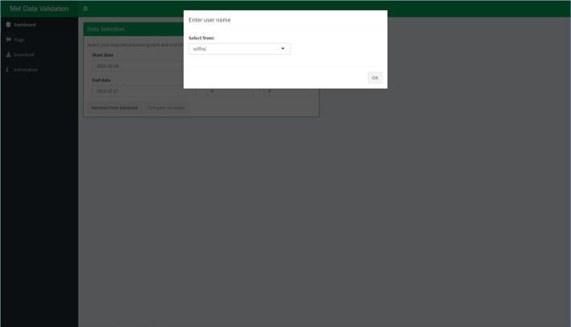
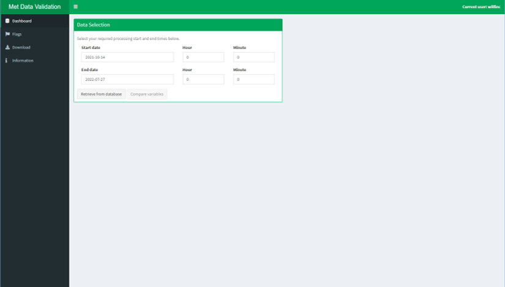
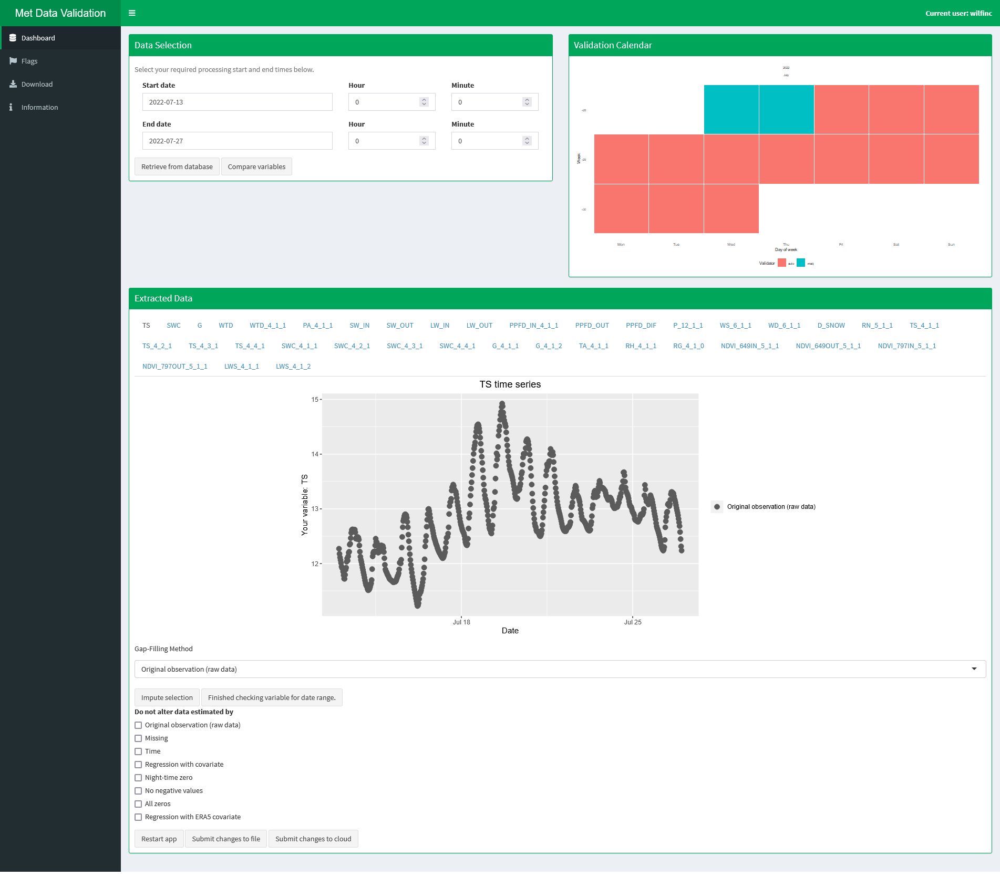
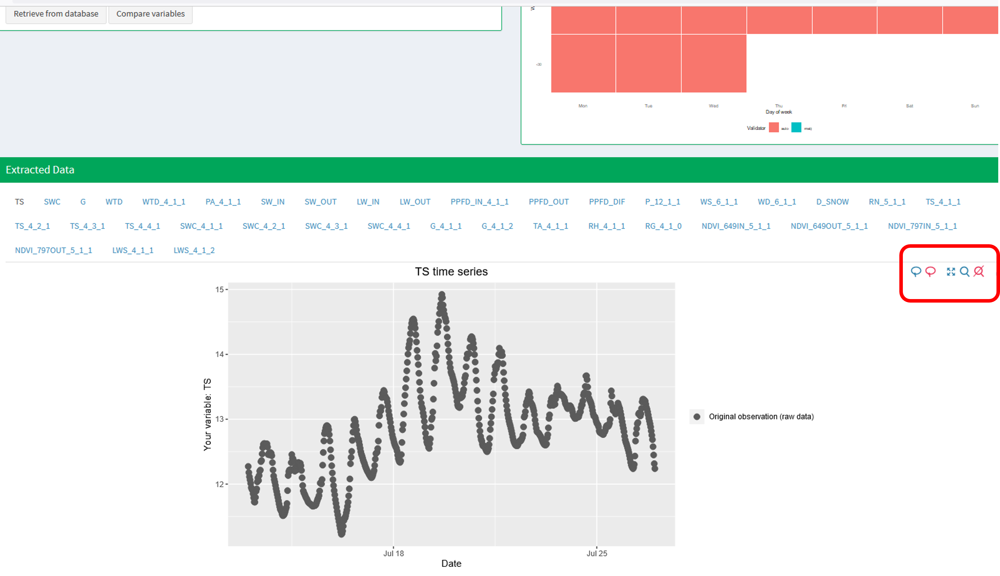
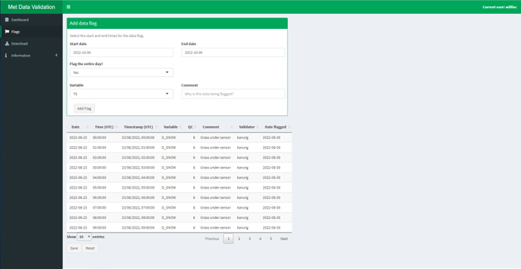
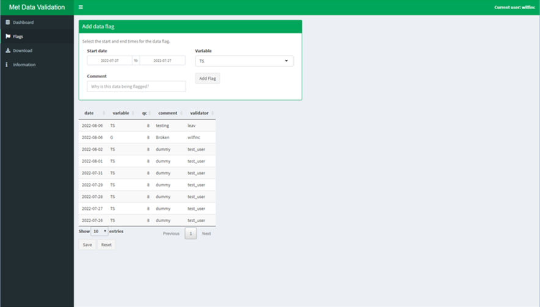
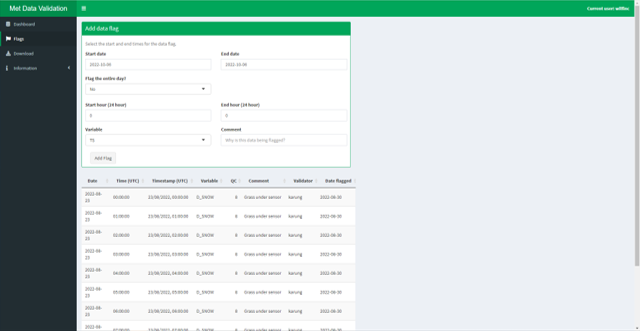
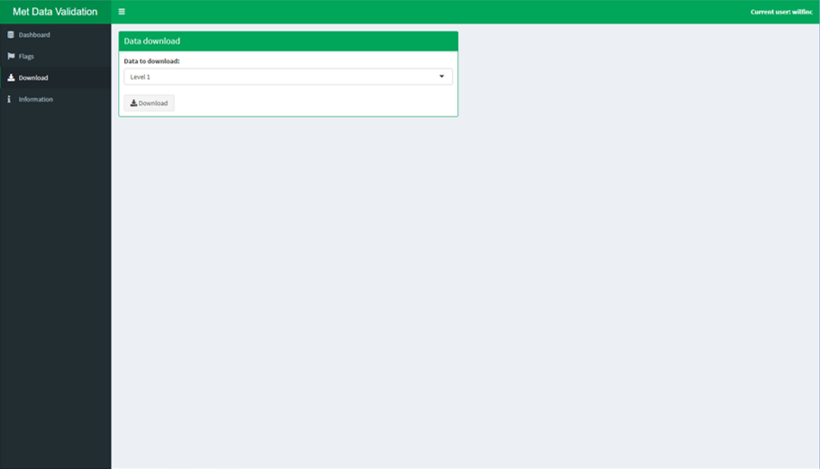
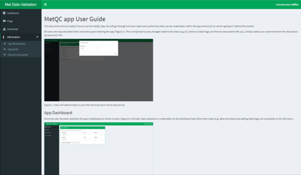

# MetQC app User Guide

This document aims to explain how to use the MetQC app. We will go through common tasks and outline how they can be undertaken within the app and touch on what is going on 'behind the scenes'. 

All users are required select their username upon entering the app (Figure 1). This is important as any changes made to the data (e.g. QC checks or data flags can then be associated with you). Simply select your username from the drop down list and click 'OK'. 

### App start-up

*Figure 1: Users will need to select a user from the drop down list on app launch.*

### App dashboard
Once the user has been selected, the app's dashboard (or home screen) (Figure 2) will load. Data validation is undertaken on the dashboard tab while other tasks (e.g. data download and adding data flags) are accessible on the left menu. 

<!------>

*Figure 2: The MetQC app dashboard*

<!------>

*Figure 3: The MetQC app dashboard after data has been retrieved.*

<!------>

*Figure 4: The plot buttons made visible (red box on right) by moving the mouse over the plot window.*

### Flagging data
<!------>

*Figure 5: Data can be flagged on the 'Data flags' tab. By default whole days are flagged.*

<!------>

*Figure 6: The data flags tab. By setting 'Flag the entire day?' to 'No' allows for start and end hours to be added.*

### Downloading data

*Figure 6: All data (level 1, 2 and the data flags) can be downloaded on the 'Download' tab. Level 1 and 2 data is downloaded as a .zip file which contains two .csv files of the data and the data qc codes. Data flag data is downloaded as a single .csv file.*

### Finding more information

*Figure 6: Further information, including the app's user guide, details of the gap-filling methods and the underlying data process, can be found on the 'Information' tab.*

   
#### Q: How do I validate data?
A: 
1. Select your start and end validation dates from the 'Data selection' box on the Dashboard.
2. Click 'Retrieve from database'. The dashboard should now update as data is retrieved.
3.  At any time, after importing data, you can compare variables by clicking on the 'Compare variables' (also in the 'Data selection' box). 
4.  The 'Validation Calendar' (top right Figure 3) shows the validation history for the data you have imported. The colours of the calendar correspond to the user who validated the data. If any data has been flagged on a given day the user is set to 'data flagged'. 'auto' is also listed as a user in this case. 
5.  The 'Extracted Data' box (Figure 3) is the interface where data are checked. Each variable has it's own tab, which can be accessed by clicking on the variable name at the top of the box.  
    - The plot shows the data extracted (for the selected variable). point colours show the current qc label. Hovering the mouse over points displays the data point timestamp and measurement value. 
6. If the data for the selected variable looks correct, clicking the 'Finished checking variable for date range' button will flag this tab as complete. The tab (top of the 'Extracted Data') box will become grey and a different variable can then be validated.
7. If data looks unreliable, data can be imputed to correct this. 
   - When the mouse is over the plot window the plot buttons will appear in the top right of the plot window (Figure 4). The left most button of these ('lasso selection') allows for point in the graph to be selected. Upon selection these will change colour (go red) to indicate their selection. Use this feature to select the unreliable looking data points. 
   -   Select the 'Gap-Filling Method' from the drop down menu below the graph. Additional details of these methods can be found in the 'Information' tab.
   -   Data can be excluded form imputation by using the tick boxes lower down.
   -   Click 'Impute selection' box to impute the data selected (minus data highlighted by ticking the tick boxes at the bottom of the page) using the gap-filling method selected.
   -   The graph will update to show the edited data. 
   -   This process can be repeated as required and the 'Finished checking variable for date range' button can be pressed when complete. 
8. When you have finished data validation the 'Submit changes' button can be pressed to save your changes. **Any unsaved changes will be lost when a new date range is selected**. All changes are now submitted to the cloud. At any point the app can be restarted by using the 'Restart app' button at the bottom of the page. 

#### Q: How do I flag a period of time when I know data could be unreliable? (e.g. broken sensor)
A: 
1. Once you've selected your username on app start-up, click on the 'Flags' tab on the left of the app. 
2. New data flags can be added by setting the start and end date of the period of concern, the variable and a brief description of why the time period is being flagged (e.g. damaged sensor). Then click 'Add Flag'. By default, whole days are flagged but by setting 'Flag the entire day?' to 'No' enables further inputs which can record the start and end times (Hours). Hours are all in 24 hours format (i.e. 2pm = 14) and can be recorded in local time (GMT/BST). 
3. Your new flag will then appear in the data flags table below. Check this looks correct. Times are converted to UTC/GMT so, depending on the time of year, the hours may change from those input by the user. A new qc code (to highlight the flag) and your username will be added automatically. 
4. If the data flag looks correct, click 'Save' to save the table. This also updates the qc codes in the data - allowing others to see the that the data has been flagged. You will then be asked if you'd like to apply these changes to the data. This process resets the app and only needs to be done if you would like to view or edit data in the 'Dashboard' tab after adding your flags. 
5. If the data flag does not look correct click 'Reset' to undo your changes. If you have saved changes which you later realise are incorrect, we can revert the data to a previous version. Only a small number of versions are stored, so let us know before more changes are saved. 

- Currently, data flags cannot be added for future dates. This is something that will may change, based on demand.
- When flagging an entire day the validation calendar will show the flagged day and the following data as being flagged. This is because the period midnight to midnight is flagged. This can be changed in the future, if this is causing a problem.

#### Q: I want to download the data
A: 
1. Once you've selected your username on app start-up, click on the 'Download' tab on the left of the app. 
2. Select the data you would like to download form the drop down menu.
3. Click download to download the data.
- Level 1 and 2 data are downloaded as .zip files which contain both the data itself and the qc data in two .csv files. 
- Data flags data is downloaded as a single .csv file.

#### Q: I selected the wrong user when the app started
A: You can change the current user by clicking on 'Current user: ... ' in the top right corner of the app. This will not update the user for any previously added data flags. 

#### Q: My question isn't listed here, I've noticed a mistake or Can the app do X, Y, Z in the future?
A: Either post in the Teams channel, log a GitHub issue or email Pete (pleav@ceh.ac.uk) or Will (wilfinc@ceh.ac.uk).  