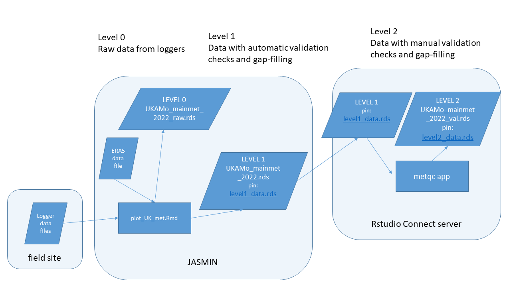
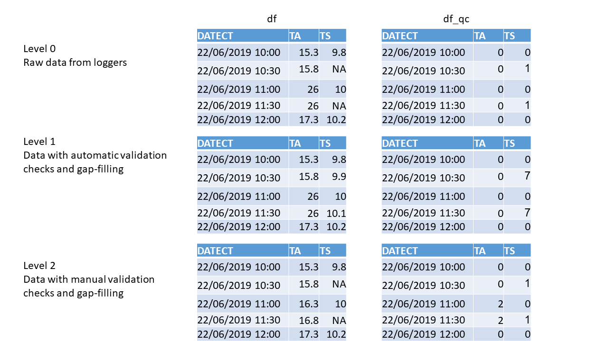

```{r rendering, eval=FALSE}
library(rmarkdown)
system.time(render("metdb.Rmd", output_file = "metdb.html"))
```

# Introduction
This document describes a workflow for processing meteorological data from field sites.
CEH operate a number of field sites where meteorological measurements are made, including air temperature, soil temperature, wind speed and direction, humidity and solar radiation. The data are recorded in the field, generally on Campbell data loggers, which download to a server PC at the field site, and then on to JASMIN.
The processing steps include: merging of files from multiple loggers, renaming of variables, conversion of units, automatic quality control by simple range-checking,  manual validation by visual inspection, imputation of missing data (gap-filling) and storage in a relational database. 
These steps are carried out be a number of R programs on JASMIN, and a Shiny app metqc on the CEH RStudio Connect server. The R programs are under version control in a [GitHub repository](https://github.com/NERC-CEH/metdb).
Currently, only data from a single field site (Auchencorth Moss) is included in this workflow, but this could be expanded more widely.

# Outline
The workflow consists of the following steps.
The data are recorded in the field on Campbell data loggers, models CR3000 and CR1000X.
These loggers are connected to a PC at the field site (IP address: 198.52.46.79, username: pollution), which downloads the data every hour using the Campbell LoggerNet software.
R scripts on JASMIN are run each night, using the cron job scheduler.
These scripts transfer the data from the field site PC to JASMIN, and process the data.
A scheduled R Markdown script on the CEH RStudio Connect server reads the data from JASMIN and writes it to a number of [pins](https://pins.rstudio.com/).
A Shiny app `metqc` on the CEH RStudio Connect server allows users to manually check the data and to impute any missing data. The output from this is written to a pin, so as to be accessible to other programs and apps, and to an Oracle database. The Level 2 data are then available to users via this pin, via the Oracle database, and will be submitted annually to CEDA where the long-term data are [archived](https://catalogue.ceda.ac.uk/uuid/8e6cbb111cfd41a19c92aadcb2d040fd).

# Terminology and Notation
We denote three levels of processing which the data  move through in the workflow.

* Level 0 - raw data as recorded on the data loggers.
* Level 1 - data which has been programatically checked for quality and had missing data imputed automatically.
* Level 2 - data which has been manually checked for quality and had missing data imputed under manual control by a user.

```{r, echo = FALSE, fig.cap = "metdb workflow"}

```

```{r, echo = FALSE, fig.cap = "Levels of data processing defined in metdb workflow."}

```

The data are stored in R as a list of two parallel data frames (with the same set of variable names, and for the same range of dates, so of the same length). These two data frames contain the data themselves (`df`) and the corresponding quality control codes (`df_qc`). The quality control codes denote whether the data are either unchanged raw data or missing / of dubious quality and not to be used.
In the latter case, the qc code denotes the method used to impute replacement data.
The `df_qc` data frame has the same structure as the `df` data frame, so every record of every variable has a corresponding qc code.
In addition, `df_qc` data frame has an extra `validator` column denoting the name of the user who performed the manual checking via the `metqc` app.

In the code, this pair of data frames is held as a list denoted as either `l_lev1` or `l_lev2` for Level 1 or 2 data.
That is, the Level 1 data produced after automatic checking each day are saved as a list object `l_lev1`, comprising the data themselves `l_lev1$df` and the qc codes `l_lev1$df_qc`.
The Level 2 data produced after manual checking in the Shiny app are saved as a list object `l_lev2`, comprising the data themselves `l_lev2$df` and the qc codes `l_lev2$df_qc`.

The data frames are generally held as data tables (i.e. using the `data.table` package), but there is inter-conversion between the two forms in the code. 

# Workflow steps
## Data logging
The raw data are collected by several data loggers running at the field site. The programs used for these loggers are stored on the Auchencorth server accessible via [this URL](http://www.auchencorth-data.ceh.ac.uk/raw_data/LoggerPr/). The LoggerNet software running on the Auchencorth field PC downloads the data every hour.

## R scripts on JASMIN
### One-off R scripts
`\metdb\scripts\ceda_era5_to_db.R`

This script reads the data extracted from BADC/CEDA for 1995 to 2020 and wrangles it into the same format, naming convention and units as the current data. It also reads the ERA5 data for Auchencorth for the same period.  
Raw, Level 0 data are written to file at this point.
It then applies some automatic checks for quality (simply testing that each variable is within a pre-defined range). Any data that were missing initially or fail the quality checks are imputed automatically, generally by regression against the corresponding variable in the ERA5 data.
These automatically checked Level 1 data are written to file and to the Oracle database.

### Daily scheduled R scripts
`\metdb\scripts\era5-update.R`

This script downloads the latest ERA5 data from Copernicus CDS.
It checks the existing data to find the date of the last successful download, and makes a request in CDS API format to get the intervening data up to the current date.  ERA5 is around a week behind real time. Requests are submitted and queued, can be monitorred [here](https://cds.climate.copernicus.eu/cdsapp#!/yourrequests) and can take hours or days. 

`\metdb\scripts\plot_UK-AMo_met.Rmd`

# Variable names
Variable names follows those defined by [ICOS](http://www.icos-etc.eu/icos/documents/instructions/bmform).


```{r readpins, eval=FALSE}
# and to read the data back
system.time(dft <- pin_read(
  board, 
  "plevy/era5_data"))
```